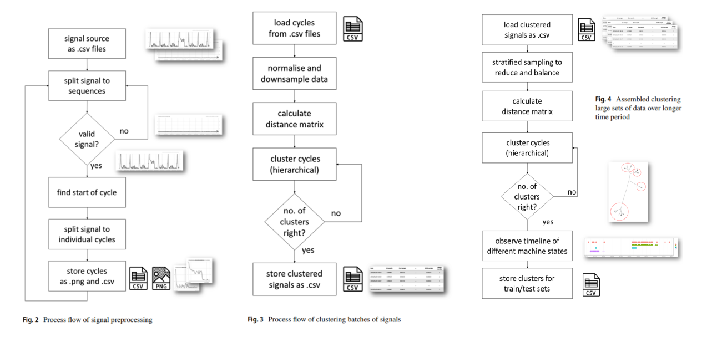
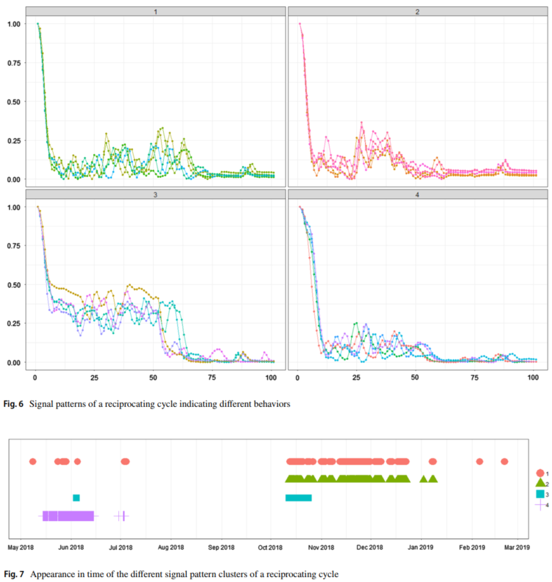

# Review: Monitoring Pneumatic Actuators' Behavior Using Real-World Data Set
- Tibor Kovac & Andrea Ko

### Abstract
- Signal preprocessing: Peak detection, garbage removal and down-sampling
- Grouping similar pattern: Wards hierarchical clustering with multivariate Euclidean distance calculation and Kohonen self-organizing map
- Signal can train, can display

### Related Works
- Sensor fault detection <paper 1 2> and AI dealt <paper 12 13>
- Data analysis: combination of wavelet transformation, feature extraction and classification with MLP-ANN and support vector machine
- Main steps: Signal acquisition, feature extraction and selection, and fault classification <paper 14 15>
    - Extract features: **Time-domain statistical analysis**, **Fourier spectral analysis** and **wavelet transformation** <paper 16>
    - Dimension reduction stategies: **principle components analysis** or **distance evalution technique** <paper 17>
    - Fault classification: Data unlabeled, unsupervised learning like **clustering** and **suport vector machine**

- Hybrid methods: unsupervised learning as data preprocessing for supervised learning
    - Supervised learning fits well, Unsupervised learning goal is to discover unknown classes of items by clustering <paper 24>
    - Imbalance class distribution: where significantly more intances from one class, lead to misclassify instances of less represented
    - Class imbalance: **algorithm adaptation**, **cost-sensitive learning** (classifier) and **data resampling** (balancing data)

- Clustering based under sampling (High accuracy) <paper 34>, **Fast-CBUS** improved computational cost <paper 30>
### Case study
- Pattern recognition: analyzing signals from pneumatic actuator realiable, cheap and able to detect wear tear
    - (Temperature-Vibration methods) Signal are non-stationary and Fourier spectrum may introduce false alarms/missed detections <paper 35>

- Signal 0-20mV collected, down-sampling from 7.8e-5 to 1.4e-2 by interpolation, only keep operating (not idling signal) of 6-8 cycles
- External_conditions: Mainly compressed air pressure, affect cycle time and signal amplitude. Cycle time off by 1% (Jamming, ...)
- Preprocessing: Find start of cycle to split cycles
- Clustering: Normalize and downsample, calculate distance matrix, cluster cycles hierarchical to a number
    - Euclidean distance to calculate dissimilarity matrix as input for clustering, 20000 signals per batch (based on computer)
    - Numbers of cluster (4) evaluated by experts
    - Clustering using fastcluster R package applying
- Assembled clustering: stratified sampling to reduce and balance, calculate distance matrix, cluster, observe timeline of different states

- Research show the data pattern (visualized) of signal overtime (prove there's pattern at a point of time)
- Also show the method of visualizing (KSOM)